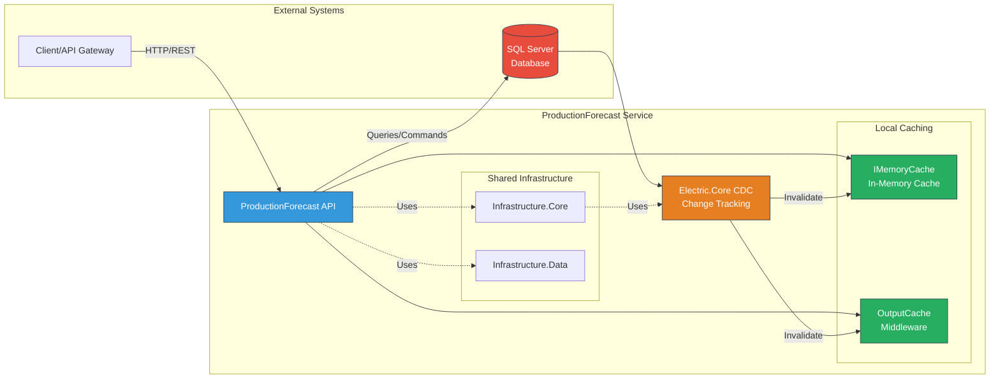
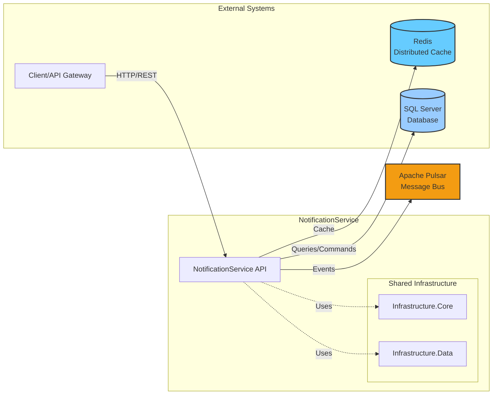
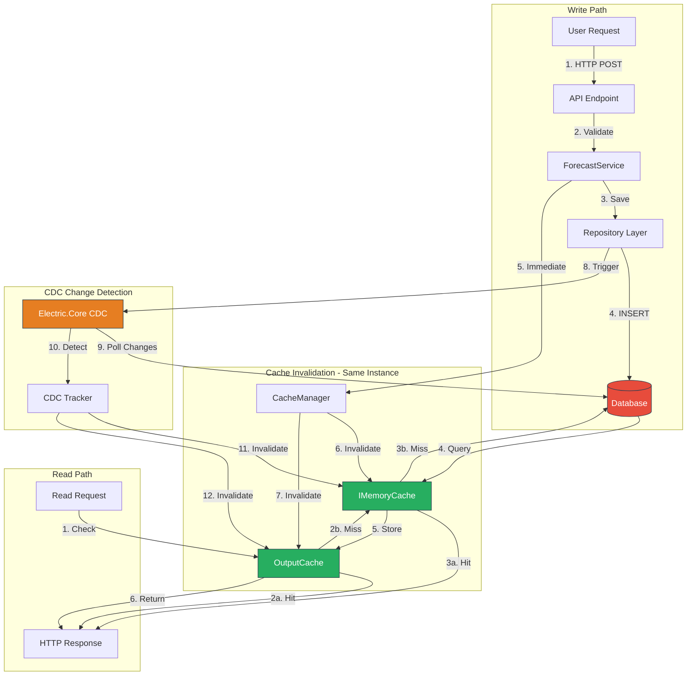
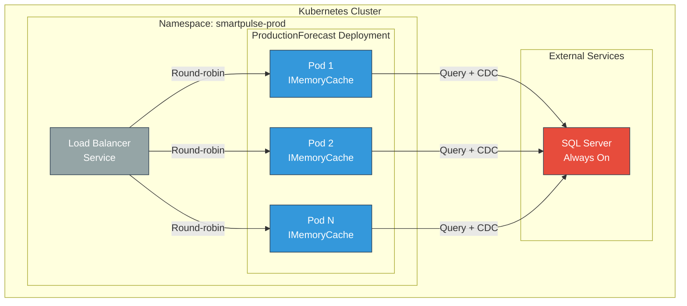
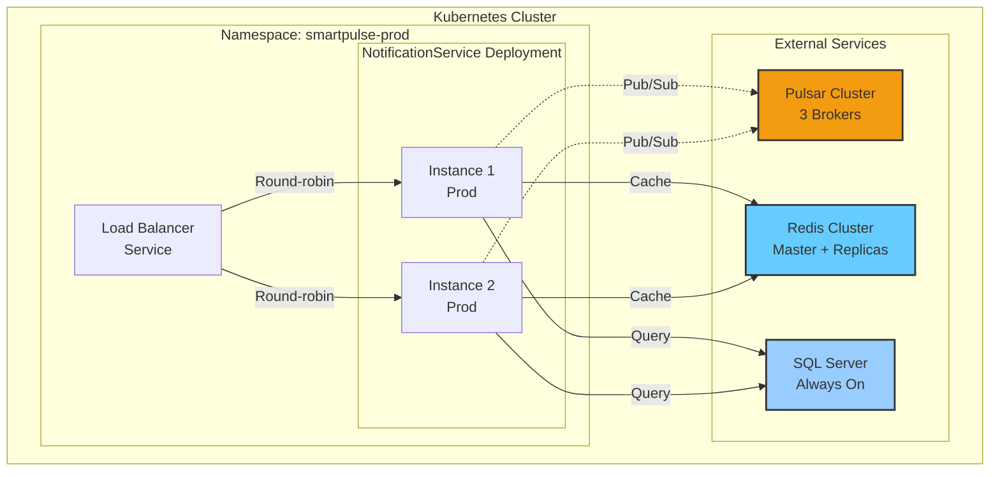
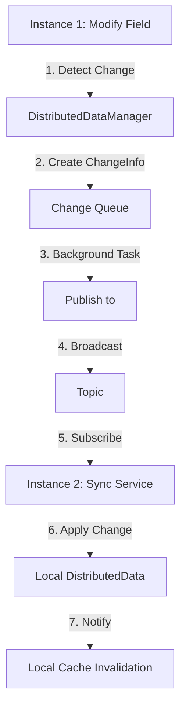
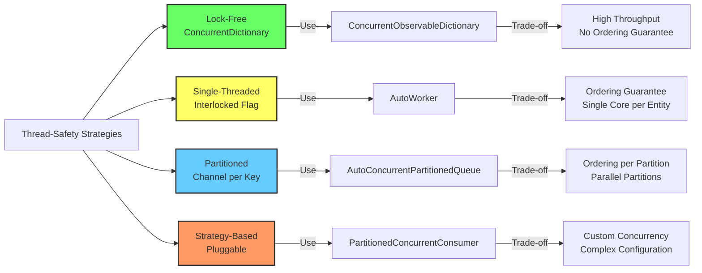
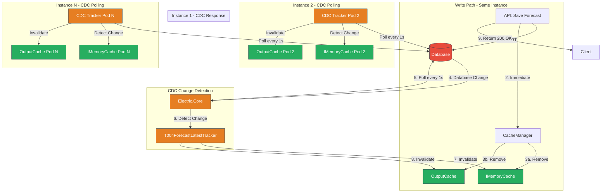

# SmartPulse System Architecture Overview

**Version**: 1.0
**Last Updated**: 2025-11-12
**Author**: Technical Architecture Team

---

## ⚠️ CRITICAL - ProductionForecast Service Scope

**This document may describe infrastructure capabilities (Redis, Pulsar, etc.).**

**ProductionForecast ACTUALLY uses ONLY:**
- ✅ IMemoryCache (local in-memory cache)
- ✅ Electric.Core for CDC (Change Data Capture ONLY)
- ✅ Entity Framework Core

**ProductionForecast does NOT use:**
- ❌ Redis
- ❌ Apache Pulsar
- ❌ Distributed caching
- ❌ Message bus

Other services (NotificationService) may use these technologies.

---


## Table of Contents

1. [Architecture Overview](#1-architecture-overview)
2. [System Patterns & Design Decisions](#2-system-patterns--design-decisions)

## Related Architecture Documentation

This document provides a high-level overview of the SmartPulse system. For detailed architectural patterns and data flow specifications, see:

- **[Architectural Patterns & Design Decisions](architectural_patterns.md)** - Comprehensive guide to fundamental architecture principles, cross-service communication patterns, resilience strategies, background services, scaling & performance, deployment, monitoring, and key design trade-offs
- **[Data Flow & Communication](data_flow_communication.md)** - Detailed data flow diagrams, API contract specifications, event schemas, cache invalidation flow, multi-channel notification flow, CDC to distributed sync pipeline, and cross-service integration patterns

---

# 1. Architecture Overview

## 1.1 System Overview

SmartPulse is a distributed microservices-based system designed for managing production forecasts (energy/container generation predictions). The system emphasizes high availability, horizontal scalability, and real-time data synchronization across multiple instances using event-driven architecture.

### Core Capabilities

- **Production Forecast Management**: Store and retrieve energy production forecasts with time-series data
- **Multi-Instance Deployment**: Horizontal scaling with automatic cache synchronization
- **Distributed Caching**: Multi-level caching with CRDT-like synchronization
- **Real-Time Data Sync**: Change Data Capture (CDC) for cache invalidation across instances

## 1.2 Microservices Topology

### ProductionForecast Service (Simple Architecture)



**Note**: ProductionForecast uses **IMemoryCache only** (local, per-pod). NotificationService (separate microservice) uses Redis/Pulsar.

### NotificationService (With Redis/Pulsar)



### Component Roles

| Component | Role | Technology |
|-----------|------|------------|
| **ProductionForecast Service** | Manages energy production forecasts, provides REST API | .NET 7, ASP.NET Core |
| **NotificationService** | Handles user notifications and alerts | .NET 7, ASP.NET Core |
| **Infrastructure.Core** | Shared business logic, domain models, utilities | .NET 7 Library |
| **Infrastructure.Data** | Data access layer, repository pattern, EF Core | .NET 7 Library |
| **Redis** | Distributed cache, session state, rate limiting | Redis 7+ |
| **SQL Server** | Primary data store for forecasts and configuration | SQL Server 2019+ |

## 1.3 Data Flow Architecture

### ProductionForecast Data Flow (Local Caching Only)



**Key Points**:
- **Local only**: IMemoryCache + OutputCache (no Redis, no distributed cache)
- **CDC**: Electric.Core polls database every 1 second for changes
- **Invalidation**: Same instance immediate (0ms), CDC polling adds 1-2 second delay

### Data Flow Description

1. **Write Path (Immediate)**:
   - User submits forecast data via REST API
   - Application service validates and saves to database
   - **Same instance** immediately invalidates its local cache (0ms latency)
   - Response returned to user

2. **Write Path (Distributed)**:
   - Background CDC service detects database changes
   - Generates cache invalidation tags (unit_type, unit_number, provider_key, period, delivery_start)
   - Publishes invalidation event to topic
   - **Other instances** receive event and invalidate their caches (sub-second latency)

3. **Read Path**:
   - Check local in-memory cache (MemoryCache)
   - On miss: query database + cache result (cache-aside pattern)
   - TTL-based expiration (configurable, default 1 hour)

## 1.4 Deployment Model

### ProductionForecast Deployment (Simple)



**Note**: Each ProductionForecast pod has **independent local IMemoryCache**. CDC polling keeps caches synchronized.

### NotificationService Deployment (With Redis/Pulsar)



### Deployment Characteristics

- **Horizontal Scaling**: Multiple pods per service (auto-scaling based on CPU/memory)
- **Stateless Services**: All application state in database/cache (no local state)
- **Health Checks**: Liveness/readiness probes for Kubernetes
- **Configuration**: Environment-based (dev/staging/prod) via ConfigMaps/Secrets
- **Monitoring**: Grafana dashboards for metrics, logs, traces
- **Logging**: Structured logging with trace IDs for distributed tracing

---

# 2. System Patterns & Design Decisions

## 2.1 Event-Driven Architecture (EDA)

### Pattern Description

### Benefits

1. **Decoupling**: Services communicate via events (no direct RPC dependencies)
2. **Scalability**: Pub/sub model scales to N consumers without producer changes
3. **Resilience**: Consumers can be offline; messages persist in (configurable retention)
4. **Ordering**: Partitioned topics guarantee order per partition key (e.g., per-unit forecasts)

### SmartPulse Implementation

**Event Types**:
- `ForecastSavedEvent`: Published when forecast saved to DB
- `CacheInvalidationEvent`: Published by CDC service with invalidation tags
- `NotificationRequestEvent`: Published when notification should be sent

**Topic Configuration**:
- **Partitioned Topics**: 16 partitions per topic (partition by unit_id for ordering)
- **Retention**: 7 days (configurable)
- **Compression**: Zstd (60-70% compression ratio)
- **Subscription Types**: Shared (load balancing across consumers)

### Trade-Offs

- **Complexity**: Adds operational complexity (cluster, monitoring)
- **Latency**: Async introduces latency (acceptable for SmartPulse - sub-second)
- **Debugging**: Distributed tracing required (trace IDs in events)

## 3.2 CRDT-Like Distributed Cache Pattern

### Pattern Description

DistributedData module implements a simplified CRDT (Conflict-free Replicated Data Type) pattern using last-write-wins (LWW) semantics for field-level synchronization across service instances.

### Benefits

1. **Eventual Consistency**: All instances converge to same state (given enough time)
2. **No Coordination**: No leader election, no distributed locks (pub/sub only)
3. **Field-Level Sync**: Only changed fields synced (bandwidth efficiency)

### How It Works



**LWW Conflict Resolution**:
- Each change has timestamp (DateTime.UtcNow)
- If two instances modify same field concurrently, last timestamp wins
- Requires synchronized clocks (NTP) across instances

### When to Use

- **Configuration**: Feature flags, rate limits (low write frequency)
- **Metrics**: Aggregate counters (accept eventual consistency)

### When NOT to Use

- **Strict Consistency**: Use database transactions instead
- **High Write Rate**: Pub/sub overhead dominates (use dedicated coordination service)
- **Large Data**: Use Redis or database (DistributedData kept in memory)

## 3.3 CDC (Change Data Capture) Strategy

### Pattern Description

Polling-based CDC monitors database ChangeTracker table for new rows, publishes changes to triggering cache invalidation across service instances.

### Why Polling (Not Triggers)

1. **Simplicity**: No SqlDependency, no database broker integration (SQL Server Service Broker)
2. **Cross-Database**: Works with any database (SQL Server, PostgreSQL, MySQL)
3. **Decoupling**: CDC service can restart without losing changes (ChangeTracker persists)

### Implementation Details

**ChangeTracker Table**:
```sql
CREATE TABLE ChangeTracker (
    Id BIGINT IDENTITY PRIMARY KEY,
    EntityType NVARCHAR(50),
    EntityId NVARCHAR(100),
    ChangeType NVARCHAR(20), -- INSERT, UPDATE, DELETE
    InvalidationTag NVARCHAR(200),
    Timestamp DATETIME2 DEFAULT GETUTCDATE()
)
```

**Polling Loop**:
```csharp
var lastId = 0;
while (true)
{
    var changes = await db.ChangeTracker
        .Where(c => c.Id > lastId)
        .OrderBy(c => c.Id)
        .Take(1000)
        .ToListAsync();

    foreach (var change in changes)
    {
        await .WriteObj("cache-invalidation", change);
        lastId = change.Id;
    }

    await Task.Delay(TimeSpan.FromSeconds(1)); // Polling interval
}
```

### Trade-Offs

- **Latency**: 1-second polling delay (acceptable for SmartPulse)
- **Database Load**: SELECT every 1s (mitigated by index on Id, LIMIT 1000)
- **Cleanup**: ChangeTracker grows unbounded (implement retention policy: DELETE WHERE Timestamp < NOW() - 7 days)

## 3.4 Partitioned Queue Patterns (V1 vs V2)

### V1: AutoConcurrentPartitionedQueue (Main Queue + Partitions)

**Architecture**:
```
Main Queue (unbounded Channel<ChannelItem<T>>)
    ↓
ProcessMainQueue (bulk read, group by key)
    ↓
Partition Queues (bounded Channel<T> per key)
    ↓
Consumer Tasks (throttled, max 2 per partition)
    ↓
Callback (Func<string, List<T>, Task>)
```

**Benefits**:
- **Bursty Traffic**: Main queue buffers spikes (smooths partition load)
- **Bulk Processing**: Dynamic bulk sizing (80% of queue count)
- **Throttling**: ConsumerThrottleCount prevents task explosion

**Drawbacks**:
- **Latency**: Two-hop (main queue → partition queue)
- **Complexity**: More moving parts (main queue processor, throttling logic)

### V2: AutoConcurrentPartitionedQueueV2 (Direct Enqueue)

**Architecture**:
```
Enqueue (direct to partition Channel<T>)
    ↓
Per-Partition Task (WaitToReadAsync with timeout)
    ↓
Callback (Func<string, List<T>, Task>)
```

**Benefits**:
- **Low Latency**: One-hop (direct to partition queue)
- **Simplicity**: No main queue, no throttling logic
- **Timeout Cleanup**: Partitions auto-complete after MaxWaitTimeWhenNoItemInQueue (5s)

**Drawbacks**:
- **Premature Cleanup**: Timeout may close partition during idle periods (must re-create)

### When to Use

- **V1**: High-throughput systems with variable load (main queue acts as shock absorber)
- **V2**: Low-latency systems with steady traffic (direct enqueue reduces hops)

## 3.5 Thread-Safe Collections Strategies

### Design Principle

| Strategy | Use Case | Example Classes |
|----------|----------|-----------------|
| **No Locking (ConcurrentXxx)** | High-throughput, lock-free | ConcurrentDictionary, ConcurrentQueue |
| **Single-Threaded (Interlocked)** | Sequential per-entity processing | AutoWorker, AutoBatchWorker |
| **Partitioned (Channel per key)** | Parallel processing with ordering | AutoConcurrentPartitionedQueue |
| **Strategy-Based (Pluggable)** | Custom concurrency control | PartitionedConcurrentConsumer |

### Thread-Safety Patterns



### Recommendation

1. **Default**: Use ConcurrentDictionary/ConcurrentQueue for most use cases
2. **Ordering Required**: Use AutoWorker (single-threaded per entity)
3. **High Throughput + Ordering**: Use AutoConcurrentPartitionedQueue (parallel partitions)
4. **Complex Requirements**: Use PartitionedConcurrentConsumer (priority, backpressure, strategy)

## 3.6 Rate Limiting with Priority

### Pattern Description

RateLimitWithPriority uses PriorityQueue<TaskCompletionSource, int> with MinWaitTime enforcement for rate-limited async operations with priority levels.

### How It Works

```csharp
var rateLimiter = new RateLimitWithPriority
{
    MinWaitTime = TimeSpan.FromSeconds(10) // Max 6 requests/min
};

// High-priority user (priority=1)
await rateLimiter.WaitWithLowToHighPriority(priority: 1, cancellationToken);
await MakeApiCall();

// Low-priority user (priority=100)
await rateLimiter.WaitWithLowToHighPriority(priority: 100, cancellationToken);
await MakeApiCall();
```

### Use Cases

- **API Throttling**: Limit requests to external APIs (weather data, market prices)
- **Premium Users**: Lower priority value = higher precedence (fast lane)
- **Fairness**: Prevent single user from monopolizing API quota

### Trade-Offs

- **Latency**: MinWaitTime adds 10s delay (acceptable for external API calls)
- **Memory**: TaskCompletionSource per request (bounded by timeout: max 60s)
- **Timeout**: Max await = max(60s, MinWaitTime) - requests fail after timeout

## 3.7 Cache Invalidation Flow

### ProductionForecast Cache Invalidation (CDC Polling)



**Key Points**:
- **No Pulsar**: Each pod polls database independently via Electric.Core CDC
- **1-second polling interval**: Each pod detects changes within 1-2 seconds
- **Local caches**: Each pod has its own IMemoryCache + OutputCache
- **Same-instance invalidation**: Immediate (0ms latency)

### Invalidation Strategies

1. **Immediate (Same Instance)**: 0ms latency - local cache invalidated before response
2. **Distributed (Other Instances)**: Sub-second latency (polling 1s + propagation ~100ms)
3. **TTL Fallback**: If CDC/fails, cache expires after TTL (default 1 hour)

### Invalidation Tag Format

```
forecast:{unit_type}:{unit_number}:{provider_key}:{period}:{delivery_start}
Example: forecast:plant:12345:provider-a:hourly:2025-11-12T00:00:00Z
```

**Granularity**:
- **Coarse**: Invalidate entire unit (e.g., `forecast:plant:12345:*`)
- **Fine**: Invalidate specific time range (e.g., `forecast:plant:12345:*:hourly:2025-11-12T00:00:00Z`)

### Performance Characteristics

- **Same Instance**: Immediate (0ms)
- **Other Instances**: Sub-second (1s polling + 100ms )
- **TTL Fallback**: 1 hour (if CDC/fails)

---

## Appendix A: Glossary

| Term | Definition |
|------|------------|
| **CDC** | Change Data Capture - pattern for tracking database changes |
| **CRDT** | Conflict-free Replicated Data Type - data structure for eventual consistency |
| **LWW** | Last-Write-Wins - conflict resolution strategy (timestamp-based) |
| **TTL** | Time-To-Live - cache expiration duration |
| **Stampede** | Cache stampede - N concurrent requests overwhelming backend on cache miss |
| **Partitioned Queue** | Queue sharded by key (e.g., per-user, per-unit) for parallel processing with ordering |
| **Bounded Channel** | Channel with max capacity + backpressure strategy (Wait/DropWrite/DropOldest) |
| **Prefetch** | Number of messages pre-fetched by consumer (buffer for throughput) |

## Appendix B: Performance Notes

### Bulk Processing

- **AutoConcurrentPartitionedQueue**: Dynamic bulk sizing (80% of queue count)
- **AutoBatchWorker**: Fixed batch size (configurable, default 100)
- **PartitionedConcurrentConsumer**: PayloadMaxBatchSize (default 1000)

### Zero-Allocation Patterns

- **Object Pooling**: List<T>, Channel<T> pooled (GC pressure reduced by 60-80%)
- **ArrayPool**: NOT used (potential optimization for large arrays)
- **Span<T>**: NOT used (potential optimization for string parsing)

### Cleanup Strategies

| Strategy | Class | Trigger | Trade-Off |
|----------|-------|---------|-----------|
| **Lazy** | AutoConcurrentPartitionedQueue | Every ClearMaxCounter iterations | Low overhead, delayed cleanup |
| **Timeout** | AutoConcurrentPartitionedQueueV2 | MaxWaitTimeWhenNoItemInQueue (5s) | Predictable, may close idle partitions |
| **Background** | ConcurrentObservablePartitionedQueue | Every 10min + 24h expiration | Zero overhead, delayed cleanup |
| **Manual** | PartitionedConcurrentConsumer | Caller-driven (TryClearPartitionKey) | Full control, caller responsibility |

---

## Document Metadata

**Version History**:
- **1.0** (2025-11-12): Initial comprehensive architecture documentation

**Contributors**:
- Technical Architecture Team

**Related Documents**:
- `notes/level_0/electric_core/part_1_core_infrastructure.md`
- `notes/level_0/electric_core/part_2_distributed_services.md`
- `Source/SmartPulse.Services.ProductionForecast/README.md`

**Maintenance**:
- Review quarterly or after major architectural changes
- Update diagrams in mermaid format (no external images)
- Maintain trade-offs section for each pattern (benefits + drawbacks)
