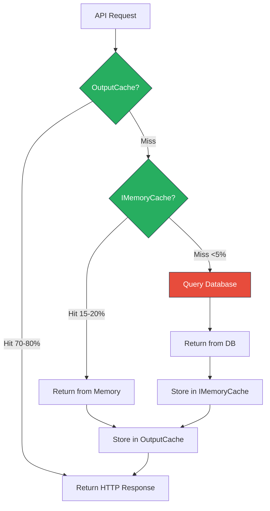
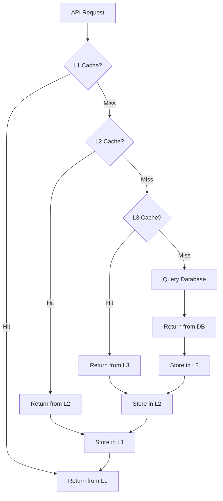
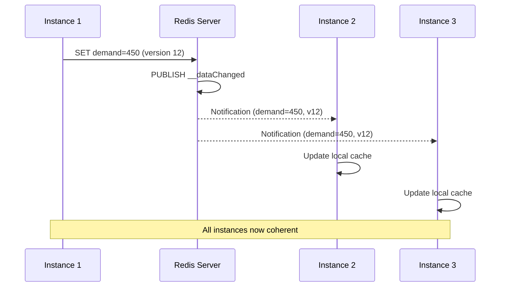
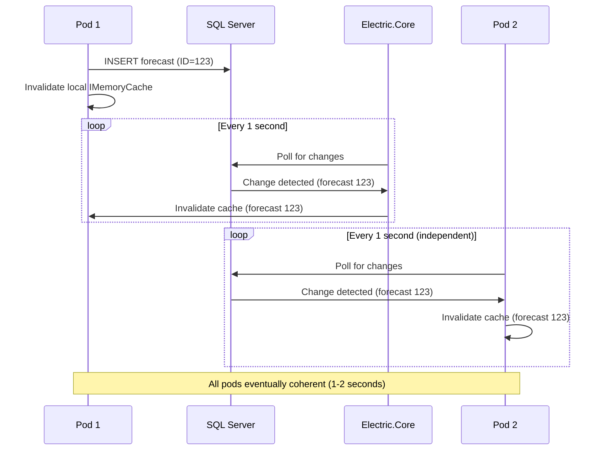

# Caching Patterns

**Last Updated**: 2025-11-13

---

## ⚠️ CRITICAL - ProductionForecast Service Scope

**This document may describe infrastructure capabilities (Redis, Pulsar, etc.).**

**ProductionForecast ACTUALLY uses ONLY:**
- ✅ IMemoryCache (local in-memory cache)
- ✅ Electric.Core for CDC (Change Data Capture ONLY)
- ✅ Entity Framework Core

**ProductionForecast does NOT use:**
- ❌ Redis
- ❌ Apache Pulsar
- ❌ Distributed caching
- ❌ Message bus

Other services (NotificationService) may use these technologies.

---


## Table of Contents

1. [Overview](#overview)
2. [Multi-Level Cache Architecture](#multi-level-cache-architecture)
3. [Cache-Aside Pattern](#cache-aside-pattern)
4. [Write-Through & Write-Behind](#write-through--write-behind)
5. [Cache Invalidation Strategies](#cache-invalidation-strategies)
6. [Distributed Cache Coherency](#distributed-cache-coherency)
7. [Performance Characteristics](#performance-characteristics)
8. [Best Practices](#best-practices)

---

## Overview

SmartPulse services implement different caching strategies based on their requirements.

### ProductionForecast: 2-Tier Local Cache Hierarchy

```
┌────────────────────────────────────────────┐
│ L1: OutputCache Middleware                 │
│ Latency: <1ms                              │
│ Capacity: HTTP response caching            │
│ TTL: 60-300 seconds                        │
└────────────────────────────────────────────┘
          ↓ (miss)
┌────────────────────────────────────────────┐
│ L2: IMemoryCache (In-Memory)               │
│ Latency: 1-2ms                             │
│ Capacity: 100MB-1GB per pod                │
│ TTL: 60-3600 seconds                       │
└────────────────────────────────────────────┘
          ↓ (miss)
┌────────────────────────────────────────────┐
│ Database (SQL Server)                      │
│ Latency: 50-500ms                          │
└────────────────────────────────────────────┘
```

**ProductionForecast Cache Selection**:

| Criteria | L1 (OutputCache) | L2 (IMemoryCache) | Database |
|----------|------------------|-------------------|----------|
| **Access Frequency** | Very High (>100/sec) | High (10-100/sec) | Low (<5/sec) |
| **Data Size** | HTTP responses | Small (<100KB) | Any |
| **Consistency** | Eventual | Eventual | Strong |
| **Scope** | Single pod | Single pod | All pods |

### NotificationService: 4-Tier Distributed Cache Hierarchy

```
┌────────────────────────────────────────────┐
│ L1: In-Memory Cache (IMemoryCache)        │
│ Latency: <1ms                              │
│ Capacity: 100MB-1GB per instance           │
│ TTL: 5-60 minutes                          │
└────────────────────────────────────────────┘
          ↓ (miss)
┌────────────────────────────────────────────┐
│ L2: EF Core Second-Level Cache             │
│ Latency: 1-5ms                             │
│ Capacity: 10K query results                │
│ TTL: 10-60 minutes                         │
└────────────────────────────────────────────┘
          ↓ (miss)
┌────────────────────────────────────────────┐
│ L3: Redis Distributed Cache                │
│ Latency: 1-10ms                            │
│ Capacity: 10GB-100GB                       │
│ TTL: 1-7 days                              │
└────────────────────────────────────────────┘
          ↓ (miss)
┌────────────────────────────────────────────┐
│ Database (SQL Server)                      │
│ Latency: 10-100ms                          │
└────────────────────────────────────────────┘
```

**NotificationService Cache Selection**:

| Criteria | L1 (Memory) | L2 (EF Core) | L3 (Redis) | Database |
|----------|-------------|--------------|------------|----------|
| **Access Frequency** | Very High (>100/sec) | High (10-100/sec) | Medium (1-10/sec) | Low (<1/sec) |
| **Data Size** | Small (<100KB) | Small (<100KB) | Medium (<1MB) | Any |
| **Consistency** | Eventual | Eventual | Eventual | Strong |
| **Scope** | Single instance | Single instance | All instances | All instances |

---

## Multi-Level Cache Architecture

### ProductionForecast Cache Flow



### NotificationService Cache Flow (4-Tier)



### NotificationService Implementation (4-Tier with Redis)

**Note**: This implementation is for NotificationService only. ProductionForecast uses IMemoryCache + OutputCache (see below).

```csharp
public class MultiLevelCacheService<T>
{
    private readonly IMemoryCache _l1Cache;
    private readonly IEasyCachingProvider _l2Cache;
    private readonly IConnectionMultiplexer _redis;
    private readonly IRepository<T> _repository;

    public async Task<T> GetAsync(string key)
    {
        // L1: In-memory cache
        if (_l1Cache.TryGetValue(key, out T cached))
        {
            _metrics.RecordCacheHit("L1");
            return cached;
        }

        // L2: EF Core second-level cache
        var l2Value = await _l2Cache.GetAsync<T>(key);
        if (l2Value.HasValue)
        {
            _metrics.RecordCacheHit("L2");

            // Populate L1
            _l1Cache.Set(key, l2Value.Value, TimeSpan.FromMinutes(5));
            return l2Value.Value;
        }

        // L3: Redis distributed cache
        var db = _redis.GetDatabase();
        var l3Value = await db.StringGetAsync(key);

        if (l3Value.HasValue)
        {
            _metrics.RecordCacheHit("L3");
            var value = JsonSerializer.Deserialize<T>(l3Value);

            // Populate L2 and L1
            await _l2Cache.SetAsync(key, value, TimeSpan.FromMinutes(10));
            _l1Cache.Set(key, value, TimeSpan.FromMinutes(5));
            return value;
        }

        // Database query
        _metrics.RecordCacheMiss();
        var dbValue = await _repository.GetByIdAsync(key);

        if (dbValue != null)
        {
            // Populate all cache levels
            await db.StringSetAsync(key, JsonSerializer.Serialize(dbValue), TimeSpan.FromHours(1));
            await _l2Cache.SetAsync(key, dbValue, TimeSpan.FromMinutes(10));
            _l1Cache.Set(key, dbValue, TimeSpan.FromMinutes(5));
        }

        return dbValue;
    }
}
```

### ProductionForecast Implementation (2-Tier Local)

```csharp
public class ForecastCacheService
{
    private readonly IMemoryCache _cache;
    private readonly IRepository<Forecast> _repository;

    public async Task<Forecast> GetForecastAsync(string forecastId)
    {
        var cacheKey = $"forecast:{forecastId}";

        // L2: IMemoryCache (L1 is OutputCache middleware, automatic)
        if (_cache.TryGetValue(cacheKey, out Forecast cached))
        {
            _metrics.RecordCacheHit("IMemoryCache");
            return cached;
        }

        // Database query
        _metrics.RecordCacheMiss();
        var forecast = await _repository.GetByIdAsync(forecastId);

        if (forecast != null)
        {
            // Store in IMemoryCache with tag for CDC invalidation
            var options = new MemoryCacheEntryOptions()
                .SetSlidingExpiration(TimeSpan.FromMinutes(10))
                .SetAbsoluteExpiration(TimeSpan.FromHours(1));

            _cache.Set(cacheKey, forecast, options);
        }

        return forecast;
        // Note: OutputCache middleware automatically caches HTTP response
    }
}
```

---

## Cache-Aside Pattern

### Overview

**Cache-Aside** (Lazy Loading): Application checks cache before querying database.

### Implementation

```csharp
public class CacheAsideRepository<T> where T : class
{
    private readonly IMemoryCache _cache;
    private readonly IRepository<T> _repository;

    public async Task<T> GetByIdAsync(string id)
    {
        var cacheKey = $"{typeof(T).Name}:{id}";

        // Try cache first
        if (_cache.TryGetValue(cacheKey, out T cached))
            return cached;

        // Load from database
        var entity = await _repository.GetByIdAsync(id);

        if (entity != null)
        {
            // Store in cache with sliding expiration
            var options = new MemoryCacheEntryOptions()
                .SetSlidingExpiration(TimeSpan.FromMinutes(5))
                .SetAbsoluteExpiration(TimeSpan.FromMinutes(30))
                .RegisterPostEvictionCallback(OnEvicted);

            _cache.Set(cacheKey, entity, options);
        }

        return entity;
    }

    private void OnEvicted(object key, object value, EvictionReason reason, object state)
    {
        _logger.LogDebug("Cache entry {Key} evicted: {Reason}", key, reason);
    }
}
```

### Pros & Cons

**Advantages**:
- ✅ Simple to implement
- ✅ Cache only what's accessed (efficient memory usage)
- ✅ Resilient to cache failures (fallback to database)

**Disadvantages**:
- ❌ Cache miss penalty (initial request slow)
- ❌ Stampede risk (multiple simultaneous misses)

---

## Write-Through & Write-Behind

### Write-Through Pattern

**Write-Through**: Write to cache and database synchronously.

```csharp
public async Task UpdateAsync(T entity)
{
    var cacheKey = GetCacheKey(entity);

    // Update cache
    _cache.Set(cacheKey, entity, TimeSpan.FromMinutes(10));

    // Update database
    await _repository.UpdateAsync(entity);

    // Notify other instances via Pub/Sub
    await _redis.GetSubscriber().PublishAsync("cache-invalidations", cacheKey);
}
```

**Pros**:
- ✅ Cache always consistent with database
- ✅ No data loss on cache failure

**Cons**:
- ❌ Higher write latency (synchronous writes)
- ❌ Reduced write throughput

### Write-Behind Pattern

**Write-Behind** (Write-Back): Write to cache immediately, flush to database asynchronously.

```csharp
public class WriteBehindCache<T>
{
    private readonly IMemoryCache _cache;
    private readonly Channel<CacheWrite<T>> _writeQueue;
    private readonly IRepository<T> _repository;

    public WriteBehindCache()
    {
        _writeQueue = Channel.CreateBounded<CacheWrite<T>>(10000);

        // Start background flusher
        _ = Task.Run(() => FlushQueueAsync());
    }

    public async Task UpdateAsync(T entity)
    {
        var cacheKey = GetCacheKey(entity);

        // Immediate cache update
        _cache.Set(cacheKey, entity, TimeSpan.FromMinutes(5));

        // Queue for database write
        await _writeQueue.Writer.WriteAsync(new CacheWrite<T>
        {
            Key = cacheKey,
            Entity = entity,
            Timestamp = DateTime.UtcNow
        });
    }

    private async Task FlushQueueAsync()
    {
        await foreach (var write in _writeQueue.Reader.ReadAllAsync())
        {
            try
            {
                await _repository.UpdateAsync(write.Entity);
            }
            catch (Exception ex)
            {
                _logger.LogError(ex, "Failed to flush cache write for {Key}", write.Key);
                // Retry or send to dead-letter queue
            }
        }
    }
}
```

**Pros**:
- ✅ Low write latency (cache only)
- ✅ High write throughput (batching possible)

**Cons**:
- ❌ Risk of data loss (cache volatile)
- ❌ Eventual consistency window

---

## Cache Invalidation Strategies

### Strategy 1: TTL-Based Expiration

**Time-To-Live**: Automatically expire after fixed duration.

```csharp
// Absolute expiration (expires at specific time)
_cache.Set(key, value, DateTimeOffset.UtcNow.AddMinutes(30));

// Sliding expiration (reset on access)
var options = new MemoryCacheEntryOptions()
    .SetSlidingExpiration(TimeSpan.FromMinutes(10));
_cache.Set(key, value, options);

// Combined (absolute + sliding)
var options = new MemoryCacheEntryOptions()
    .SetSlidingExpiration(TimeSpan.FromMinutes(5))   // Reset on access
    .SetAbsoluteExpiration(TimeSpan.FromMinutes(30)); // Max lifetime
_cache.Set(key, value, options);
```

**When to use**:
- Data changes infrequently
- Eventual consistency acceptable
- Simple implementation

### Strategy 2: Event-Based Invalidation

**Pub/Sub**: Broadcast invalidation events to all instances.

```csharp
public class EventBasedInvalidation
{
    private readonly IConnectionMultiplexer _redis;
    private readonly IMemoryCache _cache;

    public async Task InvalidateAsync(string key)
    {
        // Remove from local cache
        _cache.Remove(key);

        // Broadcast to other instances
        await _redis.GetSubscriber().PublishAsync("cache-invalidations", key);
    }

    public async Task SubscribeToInvalidationsAsync()
    {
        var subscriber = _redis.GetSubscriber();

        await subscriber.SubscribeAsync("cache-invalidations", (channel, key) =>
        {
            // Remote invalidation
            _cache.Remove(key.ToString());
            _logger.LogDebug("Invalidated cache key: {Key}", key);
        });
    }
}
```

**When to use**:
- Strong consistency required
- Distributed system with multiple instances
- Frequent updates

### Strategy 3: Version-Based Invalidation

**Versioning**: Track entity versions, invalidate on mismatch.

```csharp
public class VersionedCacheEntry<T>
{
    public T Value { get; set; }
    public int Version { get; set; }
    public DateTime CachedAt { get; set; }
}

public async Task<T> GetWithVersionCheckAsync(string key, int expectedVersion)
{
    if (_cache.TryGetValue(key, out VersionedCacheEntry<T> cached))
    {
        if (cached.Version == expectedVersion)
        {
            return cached.Value;  // Version matches
        }

        // Version mismatch - invalidate
        _cache.Remove(key);
    }

    // Load from database
    var entity = await _repository.GetByIdAsync(key);
    var version = await _repository.GetVersionAsync(key);

    _cache.Set(key, new VersionedCacheEntry<T>
    {
        Value = entity,
        Version = version,
        CachedAt = DateTime.UtcNow
    });

    return entity;
}
```

**When to use**:
- Optimistic concurrency control
- Version tracking already in place
- Conflict detection needed

### Strategy 4: Tag-Based Invalidation

**Tags**: Group related cache entries, invalidate by tag.

```csharp
public class TaggedCache
{
    private readonly IMemoryCache _cache;
    private readonly ConcurrentDictionary<string, HashSet<string>> _tagIndex;

    public void Set<T>(string key, T value, params string[] tags)
    {
        // Store value
        _cache.Set(key, value, TimeSpan.FromMinutes(10));

        // Index tags
        foreach (var tag in tags)
        {
            _tagIndex.AddOrUpdate(tag,
                _ => new HashSet<string> { key },
                (_, set) => { set.Add(key); return set; });
        }
    }

    public void InvalidateByTag(string tag)
    {
        if (_tagIndex.TryRemove(tag, out var keys))
        {
            foreach (var key in keys)
            {
                _cache.Remove(key);
            }
        }
    }
}

// Usage
_cache.Set("forecast:001", forecast, tags: new[] { "forecasts", "unit-A" });
_cache.Set("forecast:002", forecast, tags: new[] { "forecasts", "unit-B" });

// Invalidate all forecasts
_cache.InvalidateByTag("forecasts");
```

**When to use**:
- Related entities need batch invalidation
- Complex invalidation logic
- Multiple invalidation triggers

---

## Distributed Cache Coherency

### NotificationService Coherency Protocol (Redis Pub/Sub)

NotificationService uses **field-level versioning** for cache coherency across instances via Redis Pub/Sub.



### ProductionForecast Coherency (CDC Polling)

ProductionForecast uses **CDC polling** for cache coherency. Each pod polls independently.



### Implementation

```csharp
public class CacheCoherencyManager
{
    private readonly IMemoryCache _localCache;
    private readonly RedisDistributedDataManager _distributedData;

    public async Task SetAsync<T>(string key, T value)
    {
        // Get current version
        var currentVersion = await _distributedData.GetVersionAsync(key);
        var newVersion = currentVersion + 1;

        // Update local cache
        _localCache.Set(key, new VersionedEntry<T>
        {
            Value = value,
            Version = newVersion
        });

        // Update Redis + broadcast
        await _distributedData.SetAsync(
            partitionKey: "app1",
            section: "forecasts",
            dataKey: key,
            fieldName: "data",
            value: value,
            versionId: newVersion);
    }

    public async Task SubscribeToChangesAsync(CancellationToken cancellationToken)
    {
        await foreach (var change in _distributedData.GetDistributedDataChangeEnumerationAsync(
            partitionKey: "app1",
            section: "forecasts",
            dataKey: "*",
            cancellationToken: cancellationToken))
        {
            // Apply change to local cache
            ApplyChangeToLocalCache(change);
        }
    }

    private void ApplyChangeToLocalCache(DistributedDataChangedInfo change)
    {
        var key = change.DataKey;

        if (_localCache.TryGetValue(key, out VersionedEntry<object> cached))
        {
            if (change.VersionId > cached.Version)
            {
                // Remote version is newer - update
                foreach (var patch in change.PatchItems)
                {
                    ApplyJsonPatch(cached.Value, patch);
                }

                cached.Version = change.VersionId;
            }
        }
        else
        {
            // Not in cache - fetch from Redis
            _ = Task.Run(async () => await GetAsync(key));
        }
    }
}
```

---

## Performance Characteristics

### Cache Hit Rates

**Typical Hit Rates**:

| Cache Level | Hit Rate | Avg Latency | Miss Penalty |
|-------------|----------|-------------|--------------|
| L1 (Memory) | 70-80% | <1ms | 1-5ms (L2 query) |
| L2 (EF Core) | 60-70% | 1-5ms | 1-10ms (L3 query) |
| L3 (Redis) | 90-95% | 1-10ms | 10-100ms (DB query) |

**Effective Hit Rate** (L1 + L2 + L3): **~98-99%**

### Latency Breakdown

```
Request with L1 hit:     <1ms    (70% of requests)
Request with L2 hit:     1-5ms   (20% of requests)
Request with L3 hit:     5-15ms  (8% of requests)
Request with DB query:   20-100ms (2% of requests)

Average latency: ~2-5ms (95th percentile)
```

### Throughput Impact

**Cache vs Database**:

| Operation | Database | L3 (Redis) | L2 (EF Core) | L1 (Memory) |
|-----------|----------|------------|--------------|-------------|
| Read throughput | 1K-10K/sec | 50K-100K/sec | 100K-500K/sec | 500K-1M/sec |
| Write throughput | 1K-5K/sec | 50K/sec | 10K/sec | 500K/sec |

**Scaling Factor**: 50-100x improvement with caching

---

## Best Practices

### 1. Cache Sizing

**L1 (Memory Cache)**:
```csharp
services.AddMemoryCache(options =>
{
    options.SizeLimit = 1024;  // Limit to 1GB (if tracking size)
    options.CompactionPercentage = 0.25;  // Compact when 25% over limit
    options.ExpirationScanFrequency = TimeSpan.FromMinutes(5);
});
```

**L3 (Redis)**:
```yaml
# Redis configuration
maxmemory 10gb
maxmemory-policy allkeys-lru
```

### 2. TTL Selection

**Guidelines**:

| Data Type | Suggested TTL | Rationale |
|-----------|---------------|-----------|
| Static reference data | 24 hours | Changes rarely |
| User sessions | 30 minutes | Balance security and UX |
| API responses | 5-10 minutes | Reasonable staleness |
| Real-time metrics | 30-60 seconds | Freshness critical |
| Configuration | 1 hour | Infrequent changes |

### 3. Cache Stampede Prevention

**Problem**: Many concurrent requests miss cache simultaneously.

**Solution**: Distributed locking.

```csharp
public async Task<T> GetWithLockAsync(string key)
{
    // Try cache
    if (_cache.TryGetValue(key, out T cached))
        return cached;

    // Acquire distributed lock
    var lockKey = $"lock:{key}";
    var lockId = Guid.NewGuid().ToString();

    var acquired = await _redis.GetDatabase().StringSetAsync(
        lockKey, lockId, TimeSpan.FromSeconds(5), When.NotExists);

    if (acquired)
    {
        try
        {
            // We got the lock - load from database
            var value = await _repository.GetByIdAsync(key);

            if (value != null)
            {
                _cache.Set(key, value, TimeSpan.FromMinutes(10));
            }

            return value;
        }
        finally
        {
            // Release lock
            await ReleaseLockAsync(lockKey, lockId);
        }
    }
    else
    {
        // Another thread has lock - wait and retry
        await Task.Delay(100);
        return await GetWithLockAsync(key);
    }
}
```

### 4. Monitoring

**Key metrics to track**:

```csharp
public class CacheMetrics
{
    public long L1Hits { get; set; }
    public long L2Hits { get; set; }
    public long L3Hits { get; set; }
    public long Misses { get; set; }

    public double TotalHitRate =>
        (L1Hits + L2Hits + L3Hits) / (double)(L1Hits + L2Hits + L3Hits + Misses);

    public double L1HitRate => L1Hits / (double)(L1Hits + L2Hits + L3Hits + Misses);

    public TimeSpan AverageLatency { get; set; }
    public long Evictions { get; set; }
    public long CurrentSize { get; set; }
}
```

### 5. Error Handling

**Graceful degradation**:

```csharp
public async Task<T> GetAsync(string key)
{
    try
    {
        // Try all cache levels
        return await GetFromCacheAsync(key);
    }
    catch (RedisException ex)
    {
        _logger.LogWarning(ex, "Redis cache unavailable, falling back to database");

        // Fallback to database
        return await _repository.GetByIdAsync(key);
    }
}
```

---

## Related Documentation

- [Distributed Sync Patterns](./distributed_sync.md)
- [Redis Integration](../integration/redis.md)
- [EF Core Strategy](../data/ef_core.md)
- [Performance Tuning Guide](../guides/performance.md)

---

**Last Updated**: 2025-11-13
**Version**: 1.0
