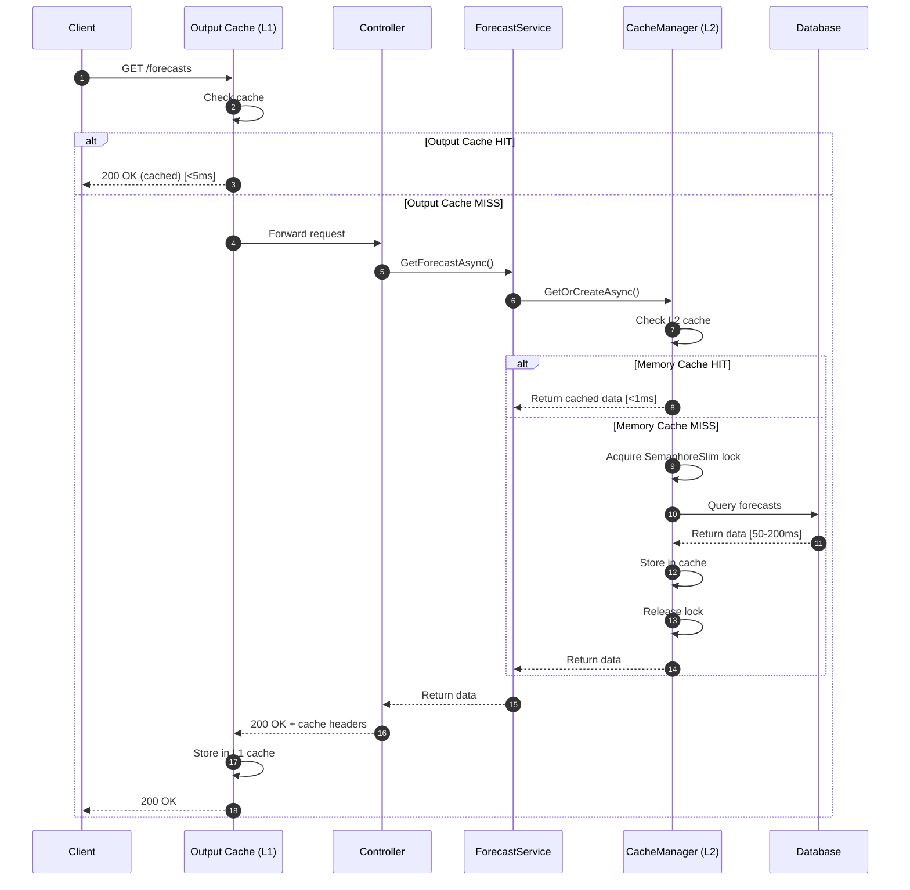
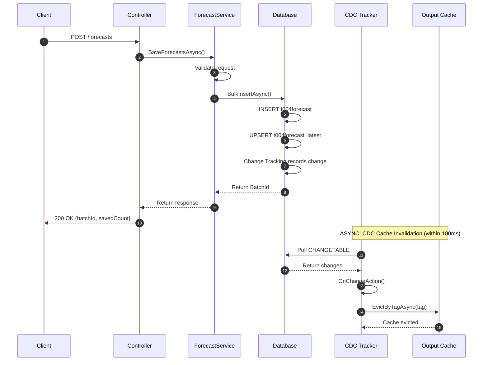
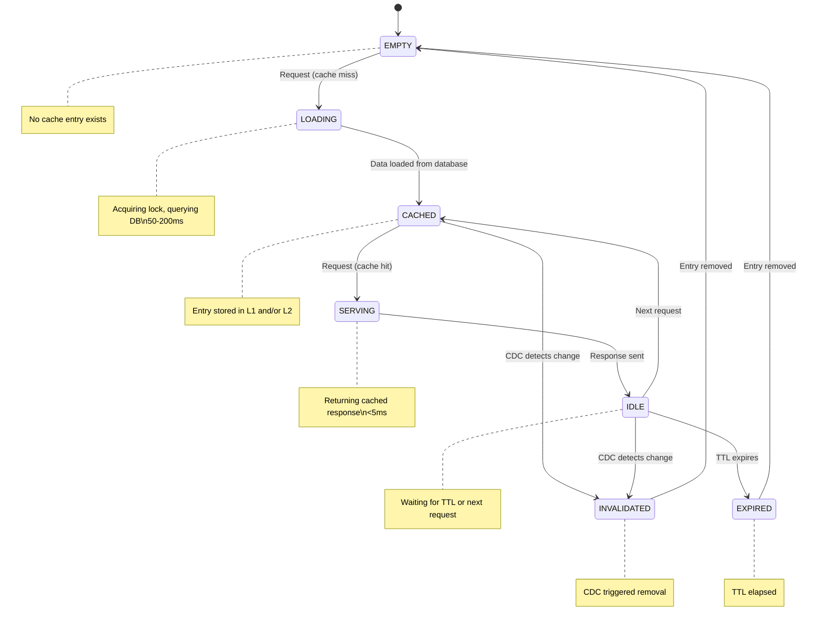
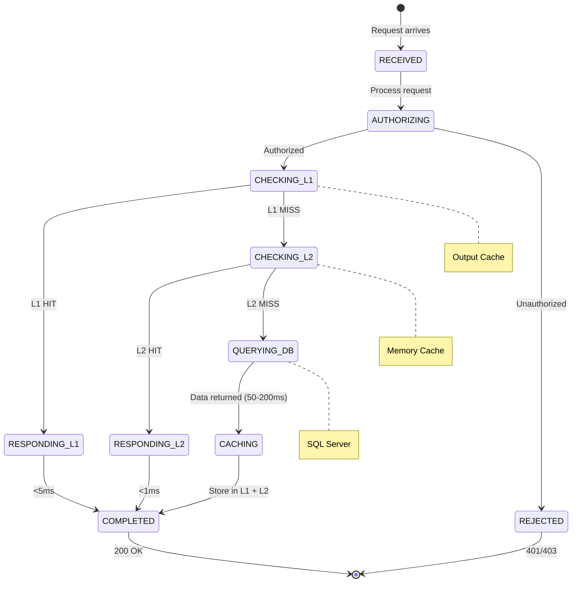
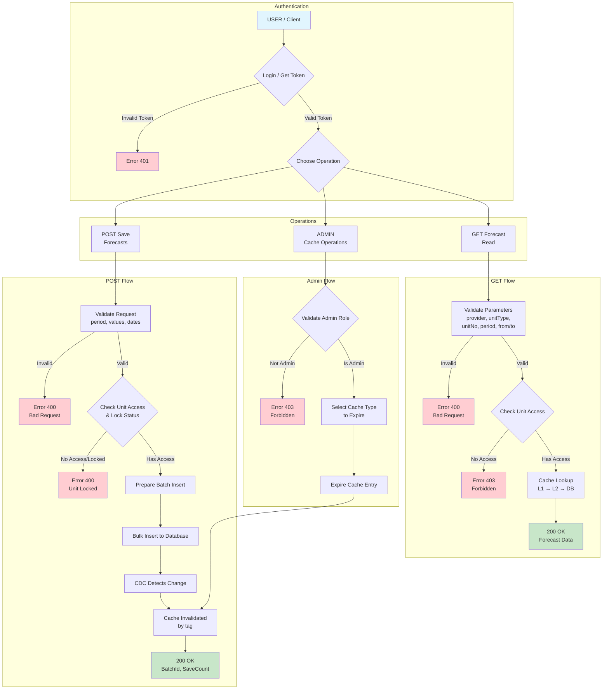

# ProductionForecast Service - Business Logic & Caching

**Component**: ProductionForecast
**Layer**: Application/Business Logic
**Assembly**: SmartPulse.Application
**Last Updated**: 2025-11-28

---

## Overview

The business logic layer orchestrates forecast operations, implements two-level caching strategy, and integrates Change Data Capture (CDC) for automatic cache invalidation. This layer coordinates between the HTTP API and database.

### Key Features

- **Two-Level Caching**: Output Cache (L1) + Memory Cache (L2)
- **CDC Integration**: Real-time database change tracking with automatic cache invalidation
- **Stampede Prevention**: SemaphoreSlim per cache key for thread-safe cache loads
- **Authorization**: Role-based and unit-level access control

### Architecture

```
┌─────────────────────────────────────────────────────────────┐
│                     Controller                               │
└─────────────────────────────┬───────────────────────────────┘
                              │
                              ▼
┌─────────────────────────────────────────────────────────────┐
│                   ForecastService                            │
│                 (Business Logic)                             │
└─────────────────────────────┬───────────────────────────────┘
                              │
          ┌───────────────────┼───────────────────┐
          │                   │                   │
          ▼                   ▼                   ▼
┌─────────────────┐ ┌─────────────────┐ ┌─────────────────┐
│  CacheManager   │ │ ForecastDbService│ │   Validation   │
│  (IMemoryCache) │ │   (EF Core)      │ │   Helpers      │
└─────────────────┘ └─────────────────┘ └─────────────────┘
          │                   │
          │                   ▼
          │         ┌─────────────────┐
          │         │   SQL Server    │
          │         │ Change Tracking │
          │         └─────────────────┘
          │                   │
          │                   ▼
          │         ┌─────────────────┐
          └─────────│  CDC Trackers   │
                    │ (6 active)      │
                    └─────────────────┘
```

**Note**: This service does NOT use Redis or Apache Pulsar. Cache invalidation is local only.

---

## ForecastService

### Purpose

Main orchestrator for forecast operations. Coordinates between HTTP API, business logic, and database.

### Class Definition

```csharp
public class ForecastService : IForecastService
{
    private readonly IForecastDbService _dbService;
    private readonly CacheManager _cache;
    private readonly ILogger<ForecastService> _logger;
    private readonly IHttpContextAccessor _httpContext;
}
```

**Lifetime**: Transient (new instance per request)

---

### Key Methods

#### 1. SaveForecastsAsync

**Signature**:
```csharp
public async Task<ForecastSaveResponseData> SaveForecastsAsync(
    string providerKey,
    string unitType,
    string unitNo,
    ForecastSaveRequestBody request,
    bool shouldReturnSaves = false,
    bool shouldSkipExistingCheck = false,
    CancellationToken cancellationToken = default)
```

**Flow**:

```
1. Authorization check (ValidateSaveRequest)
   └─ User has write access to unit
   └─ Provider key matches user's permissions

2. Validate request data
   └─ No duplicate forecasts
   └─ MWh values > 0.1
   └─ Delivery period valid

3. Check for duplicates (unless shouldSkipExistingCheck=true)
   └─ Query database for existing forecasts
   └─ Separate into "save" and "skip" lists

4. Save new forecasts
   └─ Call IForecastDbService.InsertForecastBatchAsync()
   └─ Bulk insert via EFCore.BulkExtensions
   └─ Insert to t004forecast_latest table

5. Cache invalidation (automatic via CDC)
   └─ CDC tracker detects change in t004forecast_latest
   └─ Output cache evicted by tags
   └─ Memory cache invalidated via CancellationToken

6. Return response
   └─ BatchId (unique identifier)
   └─ SavedCount (new records)
   └─ SkippedCount (duplicates)
```

**Time Complexity**: ~50-500ms depending on batch size

**Response Model**:
```csharp
public class ForecastSaveResponseData
{
    public string BatchId { get; set; }
    public int SavedCount { get; set; }
    public int SkippedCount { get; set; }
    public List<ForecastSaveData> Forecasts { get; set; }  // Optional
    public DateTime SavedAt { get; set; }
}
```

---

#### 2. GetForecastAsync

**Signature**:
```csharp
public async Task<ForecastGetLatestData> GetForecastAsync(
    string providerKey,
    string unitType,
    string unitNo,
    DateTime? from,
    DateTime? to,
    int period,
    CancellationToken cancellationToken = default)
```

**Flow**:

```
1. Authorization check
   └─ User has read access to unit

2. Determine query type
   ├─ Latest: Last saved forecast
   ├─ ByDate: For specific delivery date
   └─ ByOffset: For delivery starting N minutes from now

3. Query database (or cache)
   └─ Output cache checked first (via middleware)
   └─ Memory cache checked via CacheManager
   └─ Database query if cache miss

4. Post-process
   └─ ResolutionHelper.Normalize(forecasts, period)
   └─ TimeZoneHelper.Convert(forecasts, userTimeZone)

5. Return response
   └─ List of forecast items
   └─ Metadata (CreatedAt, ValidAfter)
```

**Time Complexity**:
- Cache hit: <5ms
- Cache miss: 50-200ms

---

#### 3. GetForecastMultiAsync

**Signature**:
```csharp
public async Task<Dictionary<string, ForecastGetLatestData>> GetForecastMultiAsync(
    ForecastGetLatestMultiRequest request,
    CancellationToken cancellationToken = default)
```

**Optimization**: Batch query instead of N individual queries

**Performance**: 10-50ms for multiple units (vs N * 50ms without batching)

---

## ForecastDbService

### Purpose

Low-level database operations. Encapsulates EF Core queries and commands.

**Lifetime**: Transient

### Class Definition

```csharp
public class ForecastDbService : IForecastDbService
{
    private readonly ForecastDbContext _dbContext;
    private readonly ILogger<ForecastDbService> _logger;
}
```

---

### Query Methods

#### GetPredictionsAsync

**Query Pattern**:
```csharp
var query = _dbContext.T004ForecastLatest
    .AsNoTracking()  // Read-only optimization
    .Where(f => f.ProviderKey == providerKey
        && f.UnitType == unitType
        && f.UnitNo == unitNo
        && f.DeliveryStart >= from
        && f.DeliveryEnd <= to)
    .OrderByDescending(f => f.DeliveryStart);

return await query.ToListAsync(ct);
```

**Indexes Used**:
- Composite: `(ProviderKey, UnitType, UnitNo, DeliveryStart DESC)`
- Query time: 20-50ms without cache

---

### Command Methods

#### InsertForecastBatchAsync

**Flow**:

```
1. Create batch info (BatchId, RecordCount, CreatedBy)
2. Map forecasts to T004Forecast entities
3. Bulk insert via EFCore.BulkExtensions
   └─ Batch size: 2000 records
4. Upsert to t004forecast_latest
5. Return BatchId
```

**Performance**: ~50-100ms for 1000-5000 records

---

## CacheManager

### Purpose

Thread-safe in-memory caching with automatic invalidation via CDC.

### Two-Level Cache Architecture

```
┌────────────────────────────────────────────┐
│ L1: Output Cache (ASP.NET Core)            │
│ Scope: HTTP responses                       │
│ Latency: <5ms                               │
│ TTL: 60 minutes                             │
│ Invalidation: Tag-based via CDC             │
└────────────────────────────────────────────┘
          ↓ (miss)
┌────────────────────────────────────────────┐
│ L2: Memory Cache (IMemoryCache)            │
│ Scope: Application data                     │
│ Latency: <1ms                               │
│ TTL: 1-1440 minutes (configurable)          │
│ Invalidation: CancellationToken via CDC     │
└────────────────────────────────────────────┘
          ↓ (miss)
┌────────────────────────────────────────────┐
│ Database (SQL Server)                      │
│ Latency: 50-200ms                           │
└────────────────────────────────────────────┘
```

**Note**: There is NO Redis or distributed cache. This is local caching only.

### Class Definition

```csharp
public class CacheManager
{
    private readonly IMemoryCache _memoryCache;
    private readonly ConcurrentDictionary<string, SemaphoreSlim> _semaphores = new();
    private readonly ConcurrentDictionary<string, CancellationTokenSource> _expirationTokens = new();
}
```

**Lifetime**: Singleton (shared across all requests)

---

### Cache Keys

| Key Pattern | TTL | Purpose |
|-------------|-----|---------|
| `powerplant_all_hierarchies` | 60 min | Unit hierarchy data |
| `all_powerplant_timezones` | 24 hours | Timezone mappings |
| `user_accessible_units_{userId}_{unitType}` | 24 hours | User permissions |
| `company_limitsettings_{companyId}` | 1 min | Forecast limits |

---

### Get Operations with Stampede Prevention

```csharp
public async Task<T?> GetOrCreateAsync<T>(
    string key,
    Func<Task<T>> factory,
    TimeSpan ttl)
{
    // Fast path: Check cache first
    if (_memoryCache.TryGetValue(key, out T cached))
        return cached;

    // Get or create semaphore for this key
    var semaphore = _semaphores.GetOrAdd(key, _ => new SemaphoreSlim(1, 1));
    await semaphore.WaitAsync();

    try
    {
        // Double-check after acquiring lock
        if (_memoryCache.TryGetValue(key, out cached))
            return cached;

        // Load from database
        var value = await factory();

        // Setup expiration token for manual invalidation
        var cts = GetNewOrExistingExpirationTokenSource(key);

        _memoryCache.Set(key, value, new MemoryCacheEntryOptions
        {
            AbsoluteExpirationRelativeToNow = ttl,
            ExpirationTokens = { new CancellationChangeToken(cts.Token) }
        });

        return value;
    }
    finally
    {
        semaphore.Release();
    }
}
```

**Benefits**:
- Prevents cache stampede (multiple simultaneous cache misses)
- Thread-safe via SemaphoreSlim per key
- Manual expiration via CancellationTokenSource

---

### Invalidation Operations

```csharp
public void ExpireCacheByKey(string key)
{
    if (_expirationTokens.TryRemove(key, out var cts))
    {
        cts.Cancel();  // Triggers cache entry removal
        cts.Dispose();
    }
}
```

---

## Change Data Capture (CDC)

### Architecture

```
┌─────────────────────────────────────────────────────────────┐
│                   SQL Server                                 │
│                Change Tracking                               │
└─────────────────────────────┬───────────────────────────────┘
                              │ CHANGETABLE queries
                              ▼
┌─────────────────────────────────────────────────────────────┐
│                   CDC Trackers                               │
│  ┌─────────────────────────────────────────────────────┐    │
│  │ T004ForecastLatestTracker (100ms poll)              │    │
│  │ T000EntityPermissionsTracker (10s poll)             │    │
│  │ T000EntityPropertyTracker (10s poll)                │    │
│  │ T000EntitySystemHierarchyTracker (10s poll)         │    │
│  │ SysUserRolesTracker (10s poll)                      │    │
│  │ PowerPlantTracker (10s poll)                        │    │
│  └─────────────────────────────────────────────────────┘    │
└─────────────────────────────┬───────────────────────────────┘
                              │ OnChangeAction
                              ▼
┌─────────────────────────────────────────────────────────────┐
│                   Cache Invalidation                         │
│  ┌──────────────────┐     ┌──────────────────┐              │
│  │ Output Cache     │     │ Memory Cache     │              │
│  │ EvictByTagAsync()│     │ ExpireCacheByKey │              │
│  └──────────────────┘     └──────────────────┘              │
└─────────────────────────────────────────────────────────────┘
```

**Note**: There is NO Pulsar event publishing. Cache invalidation is local only.

### 6 CDC Trackers

| Tracker | Table | Interval | Cache Action |
|---------|-------|----------|--------------|
| T004ForecastLatestTracker | t004forecast_latest | 100ms | Output cache eviction |
| T000EntityPermissionsTracker | t000entity_permission | 10s | Memory cache |
| T000EntityPropertyTracker | t000entity_property | 10s | Memory cache |
| T000EntitySystemHierarchyTracker | t000entity_system_hierarchy | 10s | Memory cache |
| SysUserRolesTracker | SysUserRole | 10s | Memory cache |
| PowerPlantTracker | PowerPlant | 10s | Memory cache |

---

### T004ForecastLatestTracker

**Purpose**: Track forecast changes and invalidate output cache

```csharp
public class T004ForecastLatestTracker : BaseTracker
{
    private readonly IOutputCacheStore _outputCacheStore;

    protected override string TrackerName => "T004ForecastLatestTracker";
    protected override int IntervalMs => 100; // Fast polling

    public override string TableName => "t004forecast_latest";

    protected override async Task OnChangeAction(List<ChangeItem> changes, Guid traceId)
    {
        foreach (var change in changes)
        {
            // Generate cache tag from change data
            var tag = DataTagHelper.GenerateTag(
                change.PkColumns["UnitType"]?.ToString(),
                change.PkColumns["UnitNo"]?.ToString(),
                change.PkColumns["ProviderKey"]?.ToString(),
                change.PkColumns["Period"]?.ToString(),
                change.PkColumns["DeliveryDate"]?.ToString());

            // Evict cached responses matching this tag
            await _outputCacheStore.EvictByTagAsync(tag, CancellationToken.None);
        }
    }
}
```

---

### CDC Flow Example

```
1. Forecast saved to t004forecast_latest table
2. SQL Server Change Tracking records change
3. T004ForecastLatestTracker polls CHANGETABLE (100ms interval)
4. Change detected → OnChangeAction called
5. Cache invalidation:
   - Output cache: EvictByTagAsync(tag)
   - Tag format: {unitType}.{unitNo}.{providerKey}.{period}
6. Next GET request → cache miss → fresh data from database
```

**End-to-End Latency**: ~100-150ms from database change to cache invalidation

---

## Business Logic Flows

### Flow 1: Save Forecast (Write Path)

```
Client
   │
   ▼
POST /api/v2/production-forecast/{provider}/{type}/{unit}/forecasts
   │
   ▼
Controller.SaveForecasts()
   │
   ├─ ValidateSaveRequest() → Check authorization
   │
   ▼
ForecastService.SaveForecastsAsync()
   │
   ├─ Check for duplicates (optional)
   │
   ▼
ForecastDbService.InsertForecastBatchAsync()
   │
   ├─ Bulk insert to t004forecast
   ├─ Upsert to t004forecast_latest
   │
   ▼
Database trigger/change recorded
   │
   ▼
CDC Tracker detects change (100ms poll)
   │
   ├─ Output cache evicted by tag
   │
   ▼
Response returned to client
```

**Total Time**: 50-500ms

---

### Flow 2: Get Forecast (Read Path)

```
Client
   │
   ▼
GET /api/v2/production-forecast/{provider}/{type}/{unit}/forecasts/latest
   │
   ▼
Output Cache Check (ForecastPolicy)
   │
   ├─ HIT → Return cached response (<5ms)
   │
   ▼ (MISS)
Controller.GetLatestForecasts()
   │
   ▼
ForecastService.GetForecastAsync()
   │
   ├─ Authorization check
   │
   ▼
CacheManager.GetOrCreateAsync()
   │
   ├─ Memory cache HIT → Return (<1ms)
   │
   ▼ (MISS)
ForecastDbService.GetPredictionsAsync()
   │
   ├─ Database query (50-200ms)
   │
   ▼
Store in memory cache
   │
   ▼
Store in output cache (via middleware)
   │
   ▼
Return response to client
```

**Performance**:
- Output Cache hit: <5ms
- Memory Cache hit: <1ms
- Database query: 50-200ms

---

## Sequence Diagrams

### Sequence Diagram: Get Forecast with Cache



---

### Sequence Diagram: Save Forecast with Cache Invalidation



---

## State Diagrams

### Cache Entry State Diagram

The following state diagram shows the lifecycle of a cache entry in the two-level cache system:



**State Descriptions**:

| State | Description | Duration |
|-------|-------------|----------|
| EMPTY | No cache entry exists | - |
| LOADING | Acquiring lock, querying database | 50-200ms |
| CACHED | Entry stored in L1 and/or L2 cache | Until TTL or invalidation |
| SERVING | Returning cached response | <5ms |
| IDLE | Cached but not being accessed | Until TTL or invalidation |
| INVALIDATED | CDC detected change, entry removed | Immediate |
| EXPIRED | TTL elapsed, entry removed | Immediate |

---

### Request Processing State Diagram



---

## User Flow Diagram

### End-to-End User Flow: Forecast Operations



**User Flow Descriptions**:

| Operation | Steps | Expected Time |
|-----------|-------|---------------|
| GET Forecast (cache hit) | Auth → Validate → Cache Lookup → Response | <10ms |
| GET Forecast (cache miss) | Auth → Validate → DB Query → Cache Store → Response | 50-200ms |
| POST Save Forecast | Auth → Validate → Lock Check → Bulk Insert → CDC → Response | 50-500ms |
| Admin Cache Expire | Auth → Admin Check → Expire Cache → Response | <10ms |

---

## Performance Metrics

| Operation | Throughput | Latency P50 | Latency P99 |
|-----------|-----------|------------|------------|
| Save forecast (1000 items) | 100/sec | 100ms | 300ms |
| Get latest (cache hit) | 10K+/sec | <5ms | 10ms |
| Get latest (cache miss) | 500/sec | 50ms | 200ms |
| CDC detection | - | 100ms | 150ms |
| Cache invalidation | - | <5ms | 10ms |

---

## Related Documentation

- [System Overview](../../architecture/00_system_overview.md)
- [Caching Patterns](../../patterns/caching_patterns.md)
- [CDC Documentation](../../data/cdc.md)

---

**Last Updated**: 2025-11-28
**Version**: 2.0
